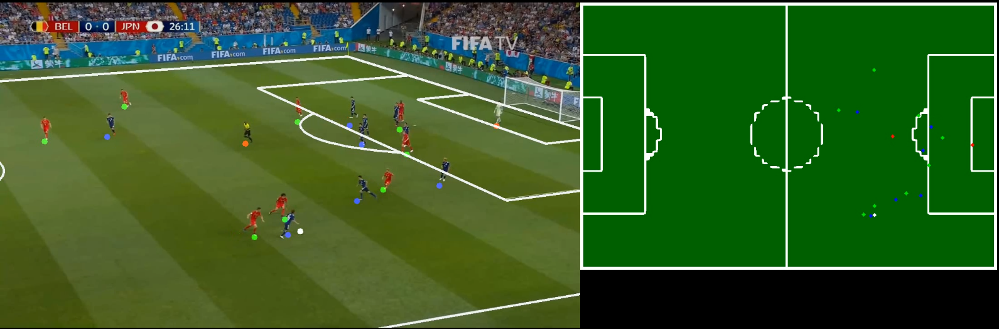

# Amateur Football Analytics using Computer Vision

An application that accepts video input from soccer games, taken from TV perspective point of view and depicts 
teams on top view perspective.
Based primarily on existing work from papers [1], [2], current projects aims to apply existing methodologies for video 
input, with as less processing time per frame as possible.

### Instructions to run demo:
1. Download files and place them in the respective directories

## References
<a id="1">[1]</a> 
Komorowski, J., Kurzejamski, G., & Sarwas, G. (2019). Footandball: Integrated player and ball detector. arXiv preprint arXiv:1912.05445.

<a id="2">[2]</a> 
Chen, J., & Little, J. J. (2019). Sports camera calibration via synthetic data. In Proceedings of the IEEE/CVF Conference on Computer Vision and Pattern Recognition Workshops (pp. 0-0).

---

Executable file:
* main.py

